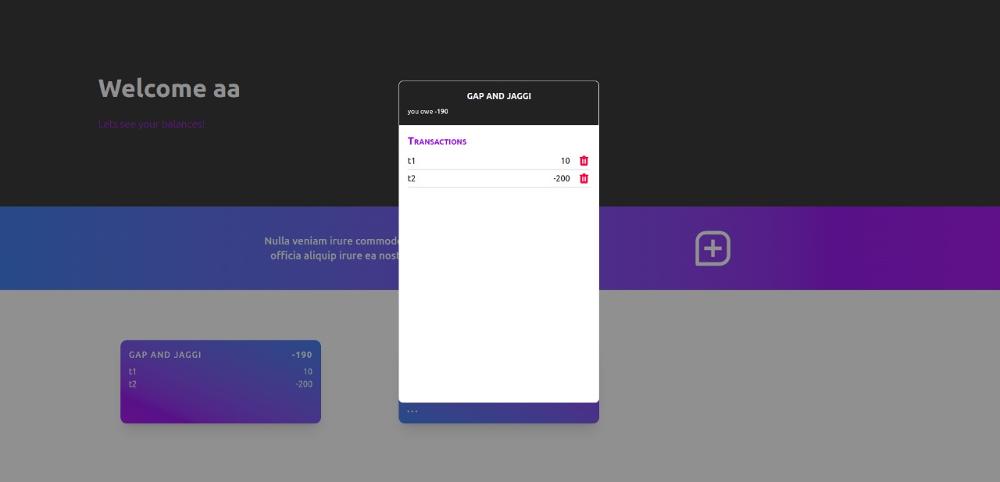

 

## Inspiration💡
With expense split apps gaining more and more popularity, we aimed to design an expense split web application that would use blockchain to store the data instead of centralised database.  

## What it does 🧭
On our web-application, a user can create a account to login to our web app. Once a user is logged in, he has the option to add expense, edit expense, settle up expenses or delete transactions. All of this is stored in logs so that a user is aware of deletions or edits made to a transaction. 

## How the WebApp Looks 🤜🔥🤛

## How we built it 🔧

We were working on solidity and smart contracts for the first time for this hackathon. On the blockchain side, the creation of expenses (credit/debit) ; editing and deletion is handled. This was built using solidity. The smart contract is deployed on hedera (which we used for the first time as well). On the front end side of things, we built the web app using next.js and tailwind css. 

## Tech Stack 🔨
1. Hedera
2. Solidity
3. Smart Contracts
4. Next.js (Typescript)
5. Tailwind CSS
6. Node.js (Typescript)

## Challenges we ran into 🏃‍♂️

1. Learning about solidity and building a smart contract over the duration of the hackathon was really challenging as none of us had used it before.

2. Integrating the front end app with the backend was difficult for us.

3. We couldn't get any mentorship on hedera, and using a newly built platform with limited support got us into a lot of bugs with deployment. 

## Accomplishments that we're proud of 🏅
1. Successfully built our first smart contract over the weekend. 
2. Created a web-application along the theme of the hedera website. 

## What we learned 🧠
1. Solidity language
2. Smart contracts
3. Javascript

## What's next ⏭
 1. We plan to extend this to a mobile application for easier access. 
 2. To store logs of every edit that is made to the transaction so as to give the user clear visibility. 

## Collaborators 🤖

Only People with broken fingers due to membrane keyboards. 
| Name      | GitHub Profile     |
| :------------- | :----------: |
|  Gyanesh Samanta   | [GitHub](https://www.github.com/gyanesh-samanta-123) |
|  Gita Alekhya Paul   | [GitHub](https://github.com/gitaalekhyapaul) |
|  Yashvardhan Jagnani   | [GitHub](https://github.com/jagnani73) |

