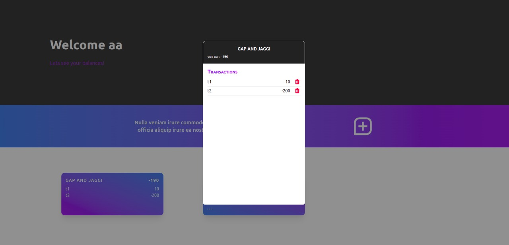

# Splitr — A Blockchain Expense-Split Web App

> **Splitwise meets Hedera. Built in 36 hours at Rookie Hacks II — first smart contract, first deployment, first weekend on Solidity.**


  

---

## About

**Who:** A 3-person team — Gyanesh Samanta, Gita Alekhya Paul, and Yashvardhan Jagnani.
**What:** A Splitwise-style expense splitting web app that records every transaction (and every edit) on a Hedera-deployed Solidity smart contract instead of a centralized database.
**When:** Built over 36 hours at the **Rookie Hacks II** hackathon (May 2022).
**Where:** Web app — Next.js frontend, Node.js API, smart contract on **Hedera Hashgraph**.
**Why:** Centralized expense apps own your transaction history. We wanted that ledger to live on-chain — auditable, tamper-evident, and yours.

## The Story

We picked the hardest stack we'd never touched. None of the three of us had written Solidity before. None of us had deployed to Hedera. We had a weekend.

Friday night the contract didn't compile. Saturday morning we figured out `solc` versions. Saturday night the deploy script broke at 2 AM with no Hedera mentor on Discord. Sunday by noon we were calling the contract from a Next.js + Tailwind frontend and logging credits, debits, edits, and deletes — every state change committed on-chain.

What shipped:

- **Solidity smart contract** handling expense create / edit / delete / settle
- **Hedera deployment pipeline** (custom build + deploy scripts in `blockchain/`)
- **Next.js + TypeScript + Tailwind** frontend (`client/`) themed to match Hedera's brand
- **Node.js + TypeScript API** (`api/`) bridging the frontend to the contract
- **Audit log** so users can see every edit/deletion ever made to a transaction

We didn't win first — but we walked out with our first deployed smart contract.

## Gallery

| Logo | Landing | UI |
|---|---|---|
|  |  |  |

---

## Tech Stack

- **Hedera Hashgraph** — smart-contract host network
- **Solidity 0.8** — contract language
- **`@hashgraph/sdk`** + **`solc`** — build & deploy
- **Next.js (TypeScript)** + **Tailwind CSS** — frontend
- **Node.js (TypeScript)** — backend API
- **ts-node**, **inquirer**, **dotenv** — tooling

## Repo Structure

```
Rookie-Hacks-II/
├── blockchain/        # Solidity contracts + Hedera deploy scripts
│   ├── contracts/
│   ├── src/           # build.ts, index.ts
│   └── build/
├── api/               # Node.js + TypeScript API
├── client/            # Next.js + Tailwind frontend
├── Repository-Assests/
├── .env.example
└── package.json
```

## Getting Started

```bash
git clone https://github.com/GyaneshSamanta/Rookie-Hacks-II.git
cd Rookie-Hacks-II
yarn install
cp .env.example .env   # fill in Hedera account ID + private key

# Compile + deploy contract to Hedera
yarn build
yarn deploy

# Run the API
yarn build:api && cd api && yarn start

# Run the frontend
cd ../client && yarn install && yarn dev
```

Visit `http://localhost:3000`.

## Contributing

Hackathon code — but PRs welcome, especially for: a mobile client, fuller edit-history UI, and gas optimization on the contract.

## License

MIT — see [`package.json`](./package.json).

## Credits

| Name | GitHub |
|---|---|
| Gyanesh Samanta | [@GyaneshSamanta](https://github.com/GyaneshSamanta) |
| Gita Alekhya Paul | [@gitaalekhyapaul](https://github.com/gitaalekhyapaul) |
| Yashvardhan Jagnani | [@jagnani73](https://github.com/jagnani73) |

Built at **Rookie Hacks II** (2022).
